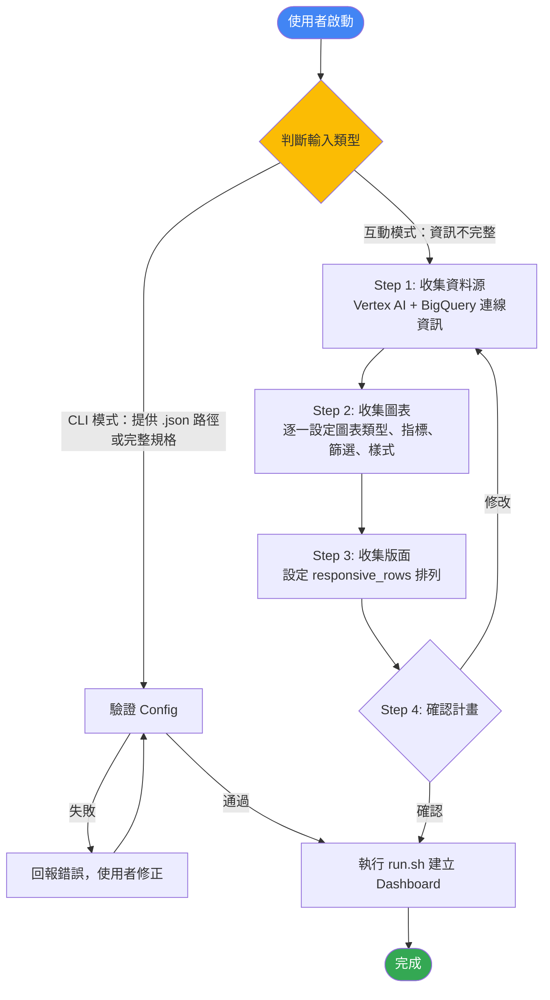

# Looker Studio Agent - 流程圖

## 兩種模式
- **CLI 模式**：使用者直接透過純指令列提供 `.json` 設定檔，跳過互動步驟，直接驗證並執行
- **互動模式**：由 Claude 逐步引導使用者完成資料源、圖表、版面的收集

```mermaid
flowchart TD
    Start([使用者啟動]) --> Detect{判斷輸入類型}

    %% CLI 模式
    Detect -->|"CLI 模式：提供 .json 路徑或完整規格"| Validate[驗證 Config]
    Validate -->|失敗| Fix[回報錯誤，使用者修正]
    Fix --> Validate
    Validate -->|通過| Execute

    %% 互動模式
    Detect -->|"互動模式：資訊不完整"| S1[Step 1: 收集資料源<br/>Vertex AI + BigQuery 連線資訊]
    S1 --> S2[Step 2: 收集圖表<br/>逐一設定圖表類型、指標、篩選、樣式]
    S2 --> S3[Step 3: 收集版面<br/>設定 responsive_rows 排列]
    S3 --> S4{Step 4: 確認計畫}
    S4 -->|修改| S1
    S4 -->|確認| Execute

    Execute[執行 run.sh 建立 Dashboard]
    Execute --> Done([完成])

    style Start fill:#4285F4,color:#fff
    style Done fill:#34A853,color:#fff
    style Detect fill:#FBBC04,color:#333
```
